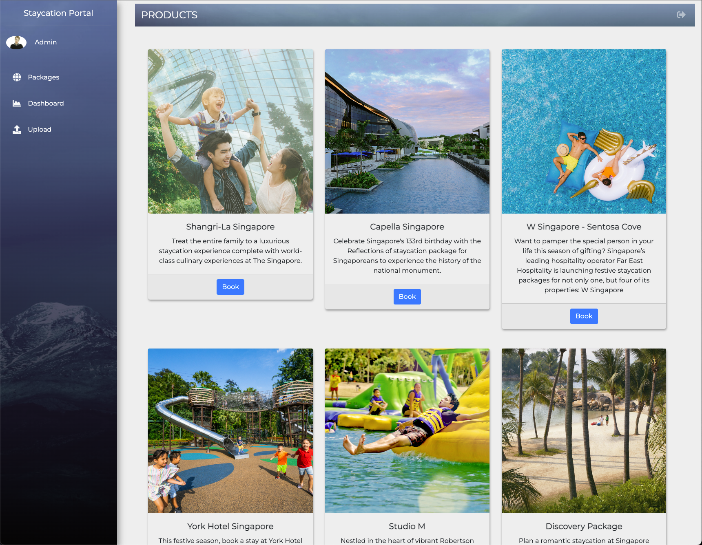
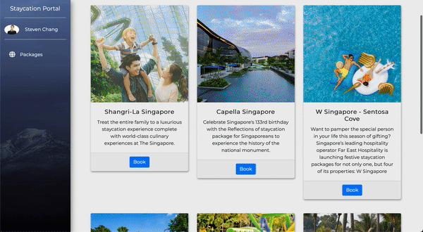
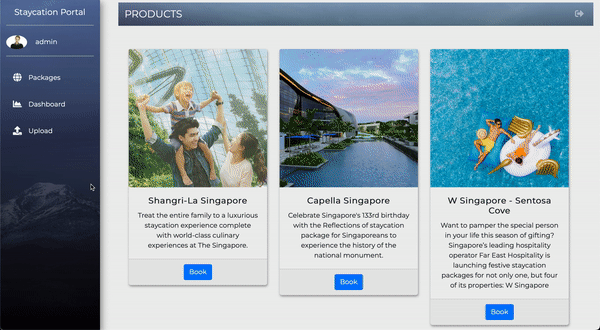

# Staycation Portal

<p align="center">
  
</p>

<p align="center">
    
    
    
    
    
</p>

The **Staycation Portal** is a minimal full stack web application developed with the [Flask](https://flask.palletsprojects.com/en/2.1.x/) framework. This project is developed as part of the [ICT239: Web Application Development](https://www.suss.edu.sg/courses/detail/ict239) module at Singapore University of Social Sciences (SUSS).

## Table of Contents
- [Staycation Portal](#staycation-portal)
  - [Table of Contents](#table-of-contents)
  - [Description](#description)
  - [Getting Started](#getting-started)
    - [Pre-requisite(s)](#pre-requisites)
    - [Poetry](#poetry)
    - [Docker](#docker)
  - [Project Organisation](#project-organisation)

## Description

The **Staycation Portal** is a platform that is designed to enable customer to register themselves to view staycation packages available, and book the package if they found that a particular one of the packages is what they need.

###### Booking Staycation

<p align="center">
  
</p>

Meanwhile, from a business administrator point-of-view, they can login the website as an admin user to batch upload site information such as staycation packages, registered users, and booking records; while also view dashboard that summarizes incoming staycation booking over a certain period of time.

###### Batch Upload Site Information

<p align="center">
  
</p>

###### Dashboard Visualisation (Bookings)

<p align="center">
  
</p>

## Getting Started

To run the project, I highly advised you create a virtual environment to self-contain the necessary dependencies required to generate recommendations.

### Pre-requisite(s)

If you are looking to run the application locally via [Poetry](#poetry) environment, you will need to install [MongoDB](https://www.mongodb.com/docs/manual/tutorial/install-mongodb-on-os-x/) by following the official instructions wrt. to your operating system.

Please ensure that MongoDB is up and running before starting up the application by using the command:
```bash
# if started as MacOS service
brew services list

# if started manually as background process
ps aux | grep -v grep | grep mongod
```

### Poetry

This project adopts [Poetry](https://python-poetry.org/) for dependency management.

To install all require packages and dependencies:
```bash
poetry install
```

As we are running the application locally, ensure that the connection to the backend reflects the localhost MongoDB setup by changing the following code in the `app/__init__.py` as per:
```python
app.config["MONGODB_SETTINGS"] = {"db": "eca", "host": "localhost"}
```

Subsequently, you may enter the virtual env created by poetry and execute the application via a custom shell script:
```bash
poetry shell

# make shell script executable
chmod +x ./start.sh
# run shell script to start application
./start.sh
```

### Docker

Other than poetry, [Docker](https://www.docker.com/) is also available to run the application in a docker container.

To run the application in containers, you can setup the Flask and MongoDB containers with:
```docker
docker compose up
```
Thereafter, you can visit the application @ [http://localhost:5000](http://localhost:5000).

## Project Organisation

```
.
├── LICENSE
├── README.md
├── app
│   ├── __init__.py
│   ├── app.py
│   ├── assets
│   │   ├── css
│   │   │   └── custom.css
│   │   ├── data
│   │   │   ├── booking.csv
│   │   │   ├── staycation.csv
│   │   │   └── users.csv
│   │   ├── img
│   │   │   ├── admin.jpeg
│   │   │   └── sidebar_background.jpeg
│   │   └── js
│   │       ├── dashboard.js
│   │       ├── dashboard_barchart_hotel.js
│   │       └── dashboard_barchart_user.js
│   ├── auth.py
│   ├── book.py
│   ├── dashboard.py
│   ├── forms.py
│   ├── staycation.py
│   ├── templates
│   │   ├── _render_field.html
│   │   ├── bar_chart.html
│   │   ├── base.html
│   │   ├── booking.html
│   │   ├── dashboard.html
│   │   ├── login.html
│   │   ├── packages.html
│   │   ├── register.html
│   │   ├── trend_chart.html
│   │   └── upload.html
│   └── users.py
├── poetry.lock
├── pyproject.toml
├── requirements.txt
└── start.sh
```
